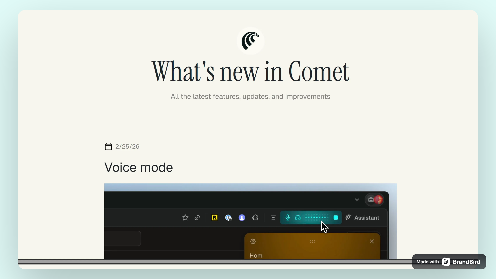

# Bootstrap Responsive Website – Practice Project

## Overview
A simple, responsive website built as a frontend practice project. The focus was on using Bootstrap's grid and utility classes to create a clean, functional layout that works across all screen sizes.

## What I Practiced
- Responsive layouts using Bootstrap's grid system
- Embedding and configuring autoplaying looped videos via Cloudinary
- Handling browser autoplay policies (muted + playsinline)
- Structuring a clean, lightweight static site

## Tech Stack
- HTML5
- Bootstrap 5
- Cloudinary (video delivery)

## Live Demo
[View on Vercel](https://perplexcitychangelog.vercel.app/)

## Preview
The site includes an autoplaying demo video that loops silently on load, delivered via Cloudinary for performance.
